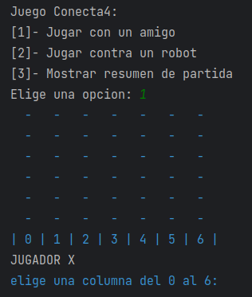
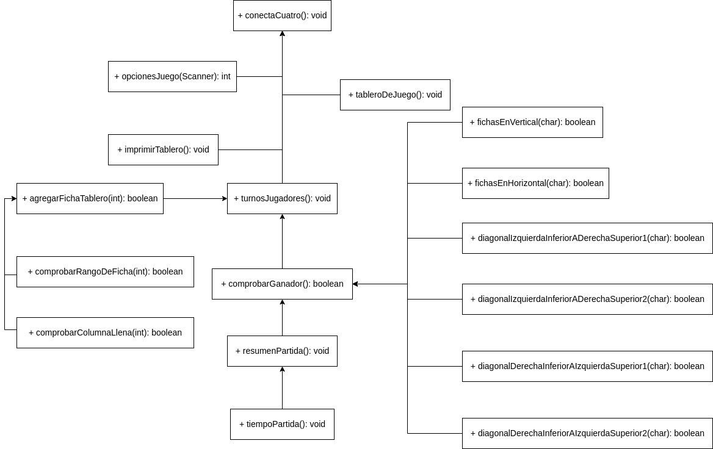

# Juego Conecta 4

## Descripción

Conecta 4 es un juego abstracto formado por dos jugadores, y se trata de introducir **fichas** en un tablero de **seis** filas por **siete** columnas.

El objetivo es alinear **4** fichas consecutivas del mismo color (rojo - amarillo) en horizontal, vertical o diagonal para poder ganar el juego.

## Guía Rapida

### Dependencias:

* Tener un IDE instalado como __Intellij IDEA__ o __Eclipse__
* Tener conocimientos de utilizar la `terminal` en Linux o Windows.

### Desplegar en IDE:
- Clonar el repositorio: `git clone https://github.com/Daruuu/JuegoConecta4.git`
- Abrir el proyecto en un `IDE`.
- Ir al directorio `JuegoConecta4/src`.
- Ejecutar la clase `Main.java`

### Ejecutar en Terminal:

Clonar el repositorio:
```bash
  git clone https://github.com/Daruuu/JuegoConecta4.git
```
Ir al directorio principal del proyecto:
```bash
  cd JuegoConecta4/src
```
Ejecutar el archivo Main.java
```bash
  java Main.java
```

## Autores

[@Daruuu](https://github.com/Daruuu)

## Version History

* 0.2
    * Various bug fixes and optimizations
    * See [commit change]() or See [release history]()
    * Estas son la funciones de comprobacion antes de mejorar la estructura [funciones antes](https://github.com/Daruuu/JuegoConecta4/commit/15aaa783ab71092966e09885170116fec3f6da00#diff-566c5a584ffb3e8a9155d1dce1d9386330e97e027e407b81cb6865844e2fd4adL76)

## Screenshots

Menu del juego:


Tablero de juego:



Representacion grafica de la matriz que he utilizado para el juego:


## Estructura UML de proyecto


## Funcionalidades

* conectaCuatro()
  - Se ejecuta el juego.


* opcionesJuego()
  - Regresa un numero entero que és la opcion que elegimos.


* imprimirTablero()
  - Imprime el tablero vacio.
 

* comprobarRangoDeFicha()
  - Comprueba que la entrada sea menor a la variable `columnas`.


* agregarFichaTablero()
  - Se actualiza el tablero con cada jugada
  


* turnosJugadores()
  - Dado una condicion se itera por cada jugador


* tiempoPartida()
  - Formateo la hora en minutos-segundos


* fichasEnHorizontal()
  - compruebo si hay un ganador de forma horizontal 


* fichasEnVertical()
  - compruebo si hay un ganador de forma vertical


* diagonalIzquierdaInferiorADerechaSuperior1(), 
  - itero para comprobar desde los extremos `[3][0] [0][3]` hasta `[5][0] [0][5]`

* diagonalIzquierdaInferiorADerechaSuperior2()
  - itero para comprobar desde los extremos `[5][2] [0][6]` hasta `[5][3] [2][6]`


* diagonalDerechaInferiorAIzquierdaSuperior1()
  - itero para comprobar desde los extremos `[3][6] [0][3]` hasta `[5][6] [0][1]`
* diagonalDerechaInferiorAIzquierdaSuperior2()
  - itero para comprobar desde los extremos `[5][5] [0][0]` hasta `[5][3] [2][0]`


* resumenPartida()
  - muestra el tiempo total de la partida jugada


* ccomprobarGanador()
  - Hace una comparacion de sí UNA de las funciones de comprobación retorna `true`, y muestra el jugador ganador.
